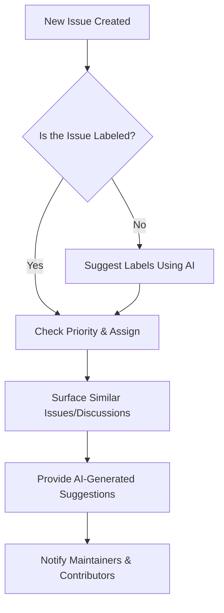
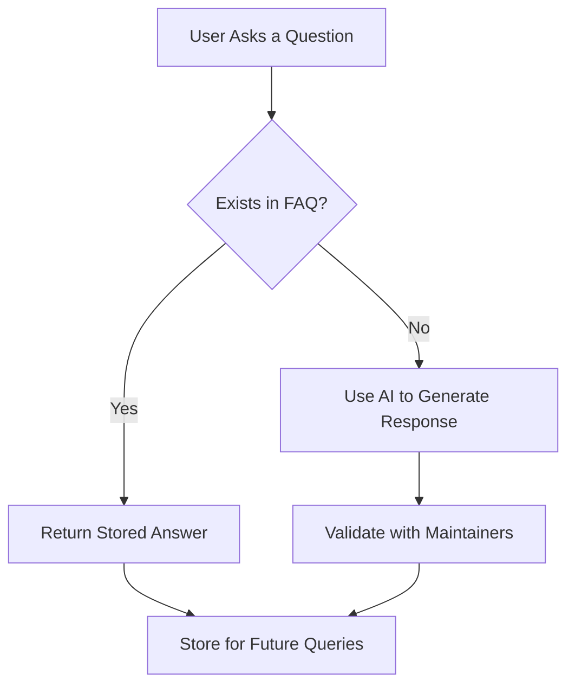

# Devr.AI

**AI-Powered Developer Relations Assistant for Open-Source Communities**

## Overview
Devr.AI is an intelligent Developer Relations (DevRel) assistant designed to seamlessly integrate with open-source communities on **Discord, Slack, GitHub, and Discourse**. It acts as a **virtual DevRel advocate**, assisting maintainers with **onboarding**, **engagement**, and **community analytics** to keep open-source projects active and well-supported.

## Features
### 🤖 AI-Driven Contributor Engagement  
- Automates welcome messages and onboarding workflows for new contributors.  
- Guides users on contributing guidelines and project structure.  

### 🛠️ Automated Issue Triage & PR Assistance  
- Prioritizes GitHub issues based on urgency and community interest.  
- Assists contributors by suggesting relevant documentation and past discussions.  

### 📚 Knowledge Base & FAQ Automation  
- Provides instant responses to frequently asked questions.  
- Reduces repetitive workload for maintainers by surfacing relevant information.  

### 📊 AI-Powered Community Analytics  
- Tracks engagement metrics and identifies active contributors.  
- Generates insights on community health and participation trends.  

## Tech Stack
- **GenAI** – Powers intelligent responses and automation.  
- **Supabase** – Provides database and real-time event handling.  
- **FastAPI** – Backend framework for API interactions and automation.  

---

## Workflow Diagrams  

⁠ ### 🛠️ Issue Triage & PR Assistance Workflow  

⁠ ### 📚 Knowledge Base Automation Workflow  

