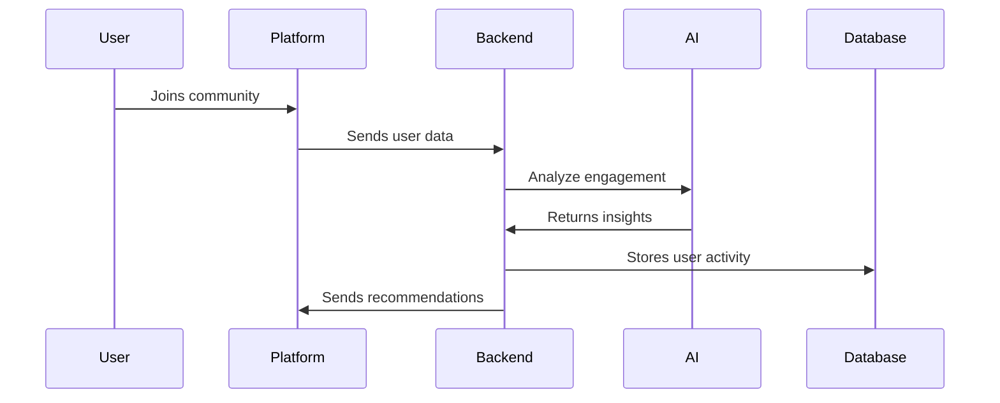
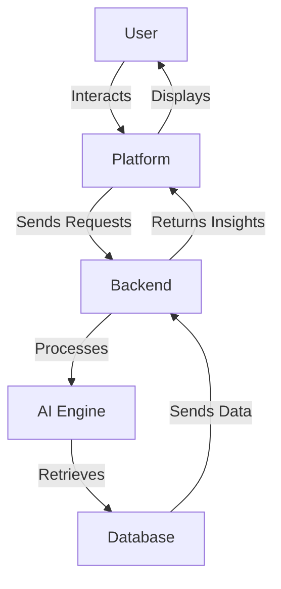

# Devr.AI

## Table of Contents
- [System Overview](#system-overview)
- [Architecture Components](#architecture-components)
- [Technical Stack](#technical-stack)
- [Core Features](#core-features)
- [Data Flow & Security](#data-flow--security)
- [Setup & Deployment](#setup--deployment)
- [Architecture Diagram](#architecture-diagram)
- [Expected Outcomes](#expected-outcomes)
- [Required Skills](#required-skills)

---

## System Overview

Devr.AI is an AI-powered Developer Relations (DevRel) assistant designed to integrate with open-source communities across platforms like Discord, Slack, GitHub, and Discourse. It automates contributor engagement, issue triage, and provides real-time project updates.

---

## Architecture Components

### 1. Integration Layer
- **Discord Bot**
- **Slack App**
- **GitHub Actions**
- **Discourse Plugin**

### 2. Core Backend
- **FastAPI Server**
- **AI-Powered Issue Triage**
- **Contributor Onboarding System**
- **Project Knowledge Retrieval**

### 3. AI & NLP Integration
- **LLM Service**
- **Knowledge Graphs**
- **Workflow Automation**

### 4. Data Storage
- **Supabase Database**
- **Vector Database for Retrieval**

---

## Technical Stack

### Frontend Technologies
- **Framework**: React.js (For Web Dashboard)
- **Styling**: TailwindCSS

### Backend Technologies
- **Framework**: FastAPI
- **Language**: Python
- **Database**: Supabase, VectorDB
- **AI & NLP**: LLMs, Knowledge Retrieval

### Integrations
- **Platforms**: Discord, Slack, GitHub, Discourse
- **Processing**: AI-Powered Automation

---

## Core Features

### 1. AI-Driven Contributor Engagement
- Automates interactions, welcomes new contributors, and guides onboarding.

### 2. Automated Issue Triage & PR Assistance
- Helps maintainers prioritize issues and assists contributors efficiently.

### 3. Knowledge Base & FAQ Automation
- Provides instant answers to common queries, reducing maintainer workload.

### 4. AI-Powered Community Analytics
- Tracks engagement metrics, identifies active contributors, and generates insights.

---

## Data Flow & Security



---

## Setup & Deployment

### Backend Setup
```bash
cd backend
python -m venv venv
source venv/bin/activate
pip install -r requirements.txt
uvicorn app.main:app --reload
```

### Frontend Setup
```bash
cd frontend
npm install
npm run dev
```

---

## Architecture Diagram



---

## Expected Outcomes

- AI-powered engagement automation
- Enhanced contributor experience
- Streamlined issue management
- Efficient knowledge retrieval

---

## Required Skills

- **GenAI**
- **Supabase**
- **FastAPI**
- **Platform Integrations (Discord, Slack, GitHub)**
